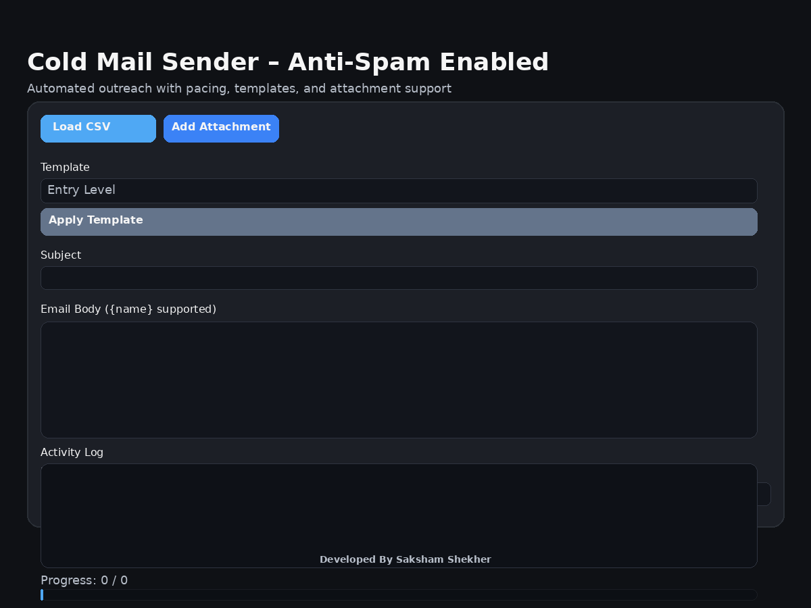

# 📧 Cold Mailer Pro

A **desktop bulk email sender** built with **Python and Tkinter** — no external dependencies required.  
Load contacts from a CSV file, pick a professional template, and send personalized cold emails with built-in anti-spam pacing, pause/resume controls, attachment support, and a real-time log.



---

## 🚀 Features

### ✉️ Email Composition
- Sender credentials (email + App Password) entered in-app — nothing is hard-coded
- Custom **Subject** line
- **Email Body** with `{name}` placeholder for per-recipient personalization
- 5 ready-to-use **templates** selectable from a dropdown:
  - Entry Level
  - General Cold Mail
  - Follow Up
  - Internship
  - Freelance
- **Apply Template** button populates the body in one click
- Optional **file attachment** (PDF, DOCX, or any file type)

### 📋 Contact Management
- Load contacts from any **CSV file** with `name` and `email` columns
- Automatic validation — malformed or incomplete rows are silently skipped
- Displays the count of valid contacts loaded

### 🛡️ Anti-Spam & Safety
- **Configurable delay** between emails (minimum 1 second; default 5 s)
- **Send limit** caps total recipients per session (≤ 200/day recommended for Gmail)
- Per-recipient error isolation — a failed send logs the error and continues
- SMTP authentication error is caught and reported clearly
- 30-second SMTP connection timeout prevents indefinite hangs

### ⏯️ Send Controls
- **SEND** — starts a background thread; UI stays responsive
- **PAUSE** — suspends sending between emails without dropping the connection
- **RESUME** — continues from exactly where it was paused
- **Clear Log** — wipes the activity log without interrupting sending

### 📊 Progress & Logging
- **Progress bar** tracks `sent / total` in real time
- **Progress label** shows the numeric count
- **Activity log** (read-only, auto-scrolling) records every success `✔` and failure `✖`
- Completion dialog and `✅ All emails processed` log entry when done

---

## 🖥️ Tech Stack

| Layer        | Technology                          |
|-------------|--------------------------------------|
| Language     | Python 3.8+                         |
| GUI          | Tkinter + ttk                       |
| Email        | smtplib (SMTP with STARTTLS)        |
| MIME         | email.mime (text, multipart, base)  |
| CSV parsing  | csv.DictReader                      |
| Concurrency  | threading.Thread + threading.Event  |

> **No third-party packages required** — pure Python standard library.

---

## 📂 Project Structure

```
Cold-Mailer/
├── cold_mailer_pro.py   # Single-file application
├── requirements.txt     # Documents stdlib dependencies & Python version
├── cold_mailer_ui.png   # UI screenshot
├── hr_contact.csv       # Sample contact list
└── README.md
```

---

## 📄 CSV File Format

Your CSV file **must** have `name` and `email` column headers (case-sensitive).  
Rows with a missing name or invalid email address are skipped automatically.

```csv
name,email
Rahul Sharma,rahul@example.com
Anita Verma,anita@company.com
```

---

## 🔐 Gmail Setup

Cold Mailer Pro uses **SMTP with STARTTLS** on port 587.  
For Gmail you must use an **App Password** — your regular password will not work.

1. Enable **2-Step Verification** on your Google Account
2. Go to **Google Account → Security → App Passwords**
3. Generate a 16-character App Password
4. Enter it in the **App Password** field in the app

> ❌ Never enter your real Gmail password.

Other SMTP providers (Outlook, Yahoo, custom mail servers) can be used by editing the `SMTP_SERVER` and `SMTP_PORT` constants at the top of `cold_mailer_pro.py`.

---

## ▶️ How to Run

### 1. Install Python 3.8+

```bash
python3 --version
```

### 2. Install tkinter (Linux only)

Tkinter ships with Python on Windows and macOS. On Ubuntu/Debian:

```bash
sudo apt-get install python3-tk
```

### 3. Launch the app

```bash
python3 cold_mailer_pro.py
```

---

## 🧪 Workflow

1. **Enter** your sender email and Gmail App Password
2. **Load CSV** — pick a file with `name,email` columns
3. **Select a template** and click **Apply Template** (or type your own body)
4. **Fill in** the Subject line
5. *(Optional)* Click **Add Attachment** to attach a file
6. **Set** Send Limit and Delay (defaults: all contacts, 5 s delay)
7. Click **SEND** — watch the log and progress bar
8. Use **PAUSE / RESUME** anytime during sending

---

## 📊 Anti-Spam Quick Reference

| Feature                  | Status  | Default         |
|--------------------------|---------|-----------------|
| Delay between emails     | ✅      | 5 seconds       |
| Configurable send limit  | ✅      | All loaded rows |
| Per-recipient isolation  | ✅      | Always on       |
| Non-blocking UI          | ✅      | Always on       |
| SMTP timeout             | ✅      | 30 seconds      |
| Pause / Resume           | ✅      | Available       |

**Recommended settings for Gmail:**
- Delay ≥ 5 seconds
- ≤ 200 emails per day

---

## 📜 License

For **educational and personal use**.  
Use responsibly and comply with applicable email outreach laws and platform policies.

---

## 👤 Author

Developed by **Saksham Shekher**  
MCA · Python · Web · Cloud · DevOps
